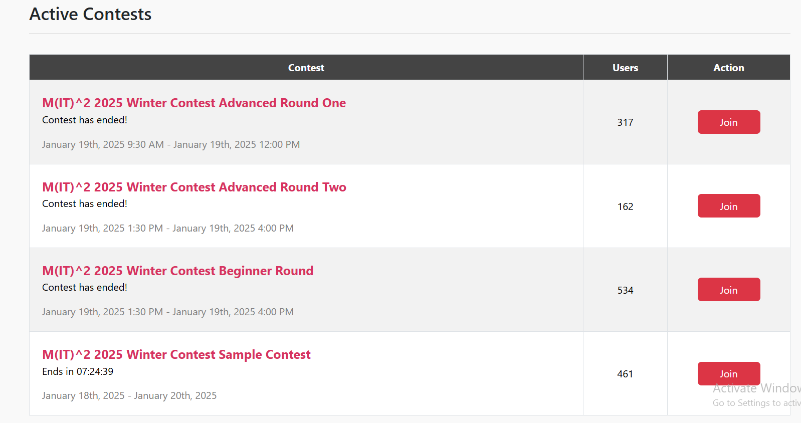
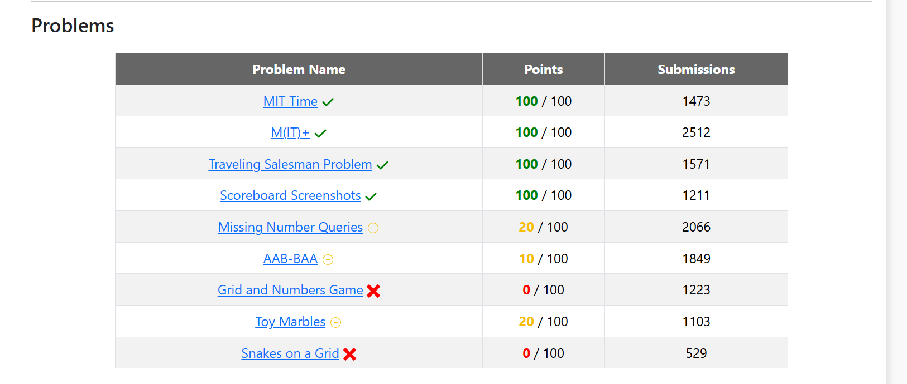
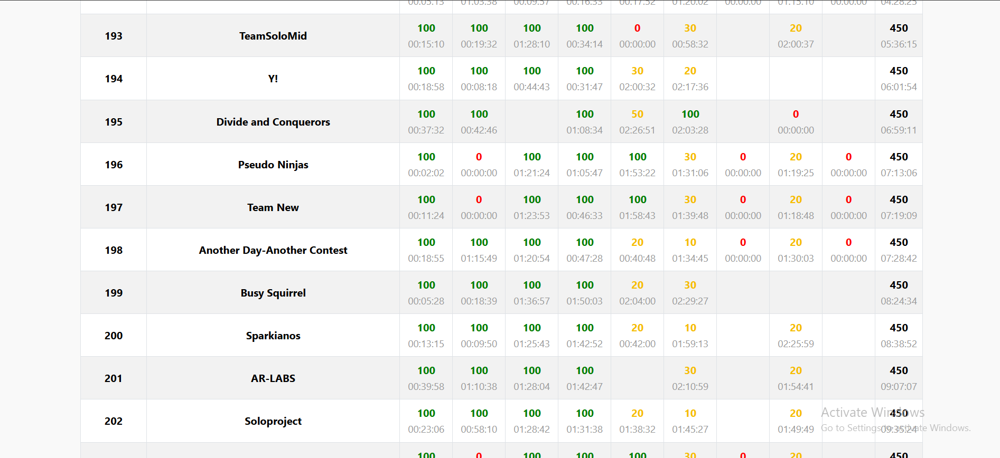

# M-IT-2-Coding-Competition-2024

This repository contains my solutions to the problems I tackled during the M-IT-2-Coding-Competition-2024. The competition was a thrilling experience filled with innovative and challenging problems. Below, you'll find a summary of the problems and the code implementations.

---


## Repository Structure  

```plaintext
.
├── MIT Coding Contest/
│   ├── Advance Round 1                        # Solution to the CALICOnstruction problem
│   └── Advance Round 2 + Begineer Round       # For understanding the problem
├── Images/
|   ├── Problems.png         # All problems
│   ├── Ranking.png          # Solution to the Coding 90s in Loot List problem
│   └── Active.png           # For understanding the problem
└── README.md                # This file

```
---

## My Problem Table:



## My Ranking:




